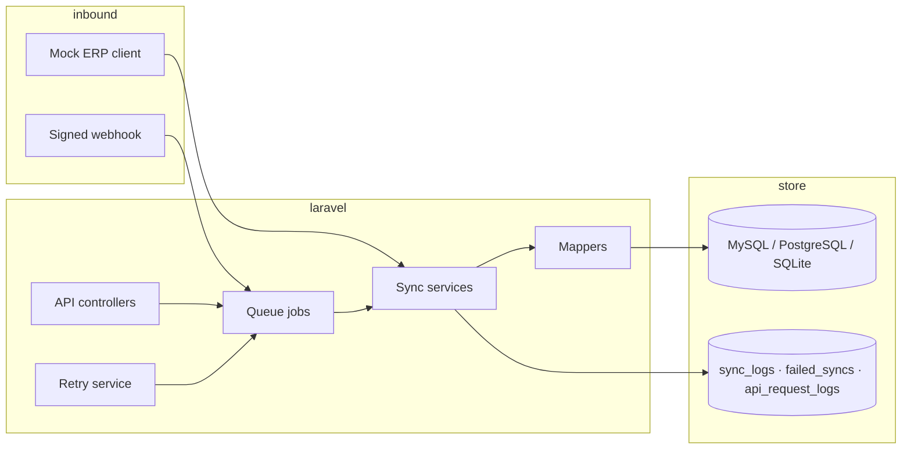

# Laravel ERP / E-Commerce Integration API

[](https://github.com/sameh-bakleh/laravel-ecommerce-erp-integration-api/actions/workflows/ci.yml)


> Laravel ERP/e-commerce integration API with webhooks, queues, HMAC signing, retry workflows, audit logging, mock ERP client, Docker, tests, and CI.

**Portfolio backend** demonstrating integration engineering between e-commerce and ERP systems: product/stock/order sync, signed webhooks, queued jobs with backoff, domain-level retry, and full audit trails — **mock ERP only**, no real tenant credentials.

| | |
|---|---|
| **Roles this supports** | Backend Engineer · Laravel Developer · API Engineer · Integration Engineer |
| **Verify in ~2 min** | `composer test` (41 tests) · `docker compose up` · [docs/api.md](docs/api.md) |

---

## Evaluate in 10 minutes

### Run with Docker

```bash
git clone https://github.com/sameh-bakleh/laravel-ecommerce-erp-integration-api.git
cd laravel-ecommerce-erp-integration-api
cp .env.docker.example .env.docker
docker compose up --build
```

The `app` container runs `php artisan migrate --force`, then serves on port **8000**. Demo credentials are in `.env.docker` (`INTEGRATION_API_TOKEN`, `ERP_WEBHOOK_SECRET`).

| URL | Purpose |
|-----|---------|
| `http://localhost:8000/api/v1` | API base |
| `http://localhost:8000/up` | Health check |

**Queue worker** (second terminal — sync jobs run asynchronously):

```bash
docker compose exec app php artisan queue:work database --tries=3 --backoff=10,60,120
```

Full guide: **[docs/docker.md](docs/docker.md)**

### Example requests

Demo token: `docker-demo-token` (from `.env.docker.example`).

```bash
# Trigger product sync (202 Accepted — processes via queue worker)
curl -s -X POST http://localhost:8000/api/v1/sync/products \
  -H "Authorization: Bearer docker-demo-token" \
  -H "Accept: application/json"

# Trigger stock sync (run product sync first)
curl -s -X POST http://localhost:8000/api/v1/sync/stock \
  -H "Authorization: Bearer docker-demo-token" \
  -H "Accept: application/json"

# Signed ERP webhook (demo secret: docker-demo-webhook-secret)
BODY='{"event":"stock.updated"}'
SIG=$(printf '%s' "$BODY" | openssl dgst -sha256 -hmac "docker-demo-webhook-secret" | awk '{print $2}')
curl -s -X POST http://localhost:8000/api/v1/webhooks/erp \
  -H "Content-Type: application/json" \
  -H "X-ERP-Signature: $SIG" \
  -d "$BODY"
```

### API documentation

No Swagger UI — endpoint reference with request/response shapes: **[docs/api.md](docs/api.md)**.

### Tests

```bash
composer install
composer test    # 41 PHPUnit tests (SQLite in-memory)
vendor/bin/pint --test
```

---

## Why it matters

Shops and ERPs rarely share one database. Someone has to own the boundary: map German ERP payloads (`Artikelnummer`, `Bestand`, `Auftragsnummer`), run syncs asynchronously, verify webhooks, recover from failures, and leave an audit trail. This repo models that **integration slice** — not a CRUD demo — as something you would extend toward Shopware Admin API or message-bus outbound sync.

---

## Skills demonstrated

| Area | Evidence in repo |
|------|------------------|
| REST API design | Versioned `/api/v1` routes, 202 async responses, `X-Request-Id` correlation |
| Webhook security | HMAC-SHA256 via `hash_equals` — [docs/webhook-security.md](docs/webhook-security.md) |
| Queues & jobs | `RunProductSyncJob`, `RunStockSyncJob`, `RunOrderSyncJob` with backoff |
| Retry / dead letter | `failed_syncs` table, `RetryFailedSyncService`, artisan + scheduled retry |
| Sync workflows | Product → stock → order pipeline — [docs/sync-workflows.md](docs/sync-workflows.md) |
| Queue / retry strategy | Two-layer retry model — [docs/queue-and-retry.md](docs/queue-and-retry.md) |
| Clean architecture | `ErpClientInterface` → services → mappers → Eloquent; thin controllers |
| Data modelling | Idempotent upserts on `sku`, `erp_order_number`; audit tables |
| Ops readiness | Docker Compose, health check, CI — [docs/docker.md](docs/docker.md) |
| Testing | PHPUnit unit + feature tests for auth, webhooks, queues, retry, audit |

---

## Features

- **Product sync** — bulk import from ERP snapshots into `products`
- **Stock sync** — per-warehouse quantities (`Lagerort`) into `stock_levels`
- **Order sync** — single B2B order by ERP number into `integration_orders`
- **Webhook receiver** — `POST /api/v1/webhooks/erp` with HMAC validation; routes `stock.updated` / `inventory.changed` to jobs
- **Failed-sync retry** — HTTP endpoint, artisan command, and scheduler hook
- **Request logging** — `api_request_logs` middleware with duration and body preview
- **Swappable ERP client** — `MockErpClient` today; `ErpClientInterface` for a real HTTP adapter

---

## Tech stack

| Layer | Choice |
|-------|--------|
| Language / framework | PHP 8.2+, Laravel 11 |
| API | REST JSON |
| Auth | Bearer token (sync routes), HMAC (webhooks) |
| Database | MySQL 8 (Docker default), PostgreSQL 16 (optional profile), SQLite (local / tests) |
| Queue | Laravel database driver (Redis optional — see [queue-and-retry.md](docs/queue-and-retry.md)) |
| Containers | Docker, Docker Compose |
| Tests | PHPUnit 11 |
| CI | GitHub Actions — tests + Laravel Pint |

---

## Architecture



---

## Documentation

| Doc | Contents |
|-----|----------|
| [docs/api.md](docs/api.md) | Endpoint reference and `curl` examples |
| [docs/webhook-security.md](docs/webhook-security.md) | HMAC signing, headers, verification flow |
| [docs/sync-workflows.md](docs/sync-workflows.md) | Product, stock, order, and webhook sync paths |
| [docs/queue-and-retry.md](docs/queue-and-retry.md) | Job backoff, `failed_syncs`, scheduler |
| [docs/docker.md](docs/docker.md) | Compose setup, workers, troubleshooting |
| [SECURITY.md](SECURITY.md) | Secrets policy, production guidance |

---

## Folder structure

```
app/
├── Console/Commands/          # integration:retry-failed
├── Http/
│   ├── Controllers/Api/       # Sync + webhook entrypoints (dispatch only)
│   └── Middleware/            # Bearer auth, API request logging
├── Integration/
│   ├── Erp/Contracts/         # ErpClientInterface
│   ├── Erp/Mock/              # MockErpClient
│   ├── Mappers/               # ERP JSON → model attributes
│   ├── Services/              # Product, stock, order, webhook, retry
│   └── Support/               # Sync types, audit recorder
├── Jobs/                      # Queued sync workers
└── Models/                    # Domain + audit models

database/migrations/           # products, stock_levels, integration_orders, audit tables
docs/                          # API, security, sync, queue, Docker guides
tests/Unit/                    # Mappers, webhook, retry, audit logic
tests/Feature/                 # HTTP flows, queue dispatch, artisan command
```

---

## API overview

| Method | Path | Auth |
|--------|------|------|
| `POST` | `/api/v1/sync/products` | Bearer |
| `POST` | `/api/v1/sync/stock` | Bearer |
| `POST` | `/api/v1/sync/orders/{erpOrderNumber}` | Bearer |
| `POST` | `/api/v1/sync/retry-failed` | Bearer |
| `POST` | `/api/v1/webhooks/erp` | `X-ERP-Signature` |
| `GET` | `/up` | — |

Details: **[docs/api.md](docs/api.md)**

---

## How to run

See **[Evaluate in 10 minutes](#evaluate-in-10-minutes)** for Docker quickstart, example `curl` commands, and tests.

### Local (SQLite)

```bash
cp .env.example .env
php artisan key:generate
# Set DB_CONNECTION=sqlite and DB_DATABASE=database/database.sqlite in .env
touch database/database.sqlite
composer install && php artisan migrate && php artisan serve
```

---

## How to test

```bash
composer install
composer test
```

| Suite | Covers |
|-------|--------|
| `tests/Unit/` | Mappers, webhook signature + routing, retry logic, audit recorder, job backoff |
| `tests/Feature/` | Auth, sync flows, queue dispatch, webhook validation, HTTP audit logging |

PHPUnit runs on in-memory SQLite with test-only secrets from `phpunit.xml`.

---

## CI/CD

Workflow: [`.github/workflows/ci.yml`](.github/workflows/ci.yml)

| Job | Command |
|-----|---------|
| **PHPUnit** | `composer test` on PHP 8.2 |
| **Pint** | `vendor/bin/pint --test` |
| **Composer audit** | `composer audit` (advisory scan) |

Runs on every push and pull request to `main` / `master`.

See [CONTRIBUTING.md](CONTRIBUTING.md) for local development and PR guidelines.

---

## Security & privacy

- **No real ERP credentials or tenant URLs** — mock data and sample tokens only.
- Copy `.env.docker.example` → `.env.docker` for Docker; never commit `.env` or `.env.docker`.
- Demo tokens (`docker-demo-token`, etc.) are for **local sandboxes only**.

Full notes: **[SECURITY.md](SECURITY.md)** · **[docs/webhook-security.md](docs/webhook-security.md)**

---

## Recruiter note

This is a **portfolio integration project**, not a production deployment. It shows how I structure ERP-facing work: contract-based clients, validated mappers for German field names, async boundaries, explicit failure and retry semantics, and traceable logs. A technical interviewer can follow one request from controller → job → service → database in under ten minutes, or run the test suite without external dependencies.

---

## License

MIT — see [LICENSE](LICENSE).
