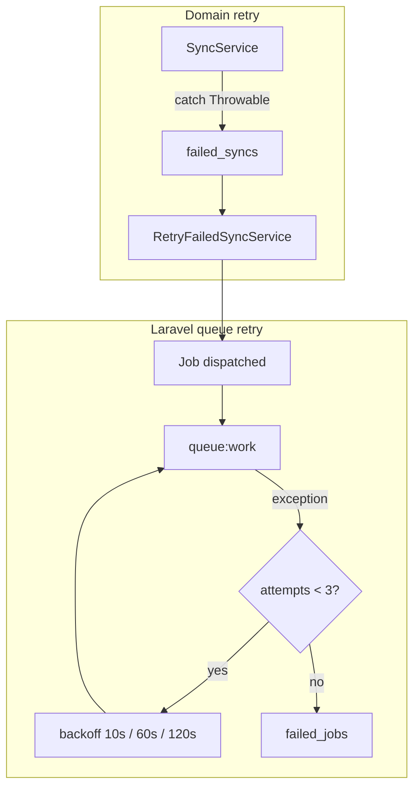

# Queue and retry strategy

Sync work uses **two complementary retry layers**: Laravel queue job retries (infrastructure) and a domain `failed_syncs` table (business-level dead-letter queue).

## Queue configuration

| Setting | Default | Purpose |
|---------|---------|---------|
| `QUEUE_CONNECTION` | `database` | Jobs stored in `jobs` table |
| Driver alternatives | `sync`, `redis` | `sync` for tests; `redis` for production throughput |

Jobs implement `ShouldQueue` and are dispatched from controllers, webhooks, and `RetryFailedSyncService`.

### Job retry policy

All sync jobs share the same Laravel-level settings:

| Property | Value |
|----------|--------|
| `$tries` | `3` |
| `$backoff` | `[10, 60, 120]` seconds |

Classes: `RunProductSyncJob`, `RunStockSyncJob`, `RunOrderSyncJob`.

When a job throws after all tries, Laravel moves it to `failed_jobs` (framework dead letter). Independently, sync **services** write to `failed_syncs` on the first unhandled exception during `handle()`.



## Domain-level `failed_syncs`

When a sync service catches a failure it:

1. Writes `sync_logs` with `status = failed`
2. Inserts `failed_syncs` with `status = pending_retry`, `attempts = 0`, `max_attempts = 5`

| Column | Role |
|--------|------|
| `sync_type` | `product_bulk`, `stock_bulk`, `order_single` |
| `reference_key` | Order number or `bulk` |
| `attempts` / `max_attempts` | Domain retry counter (default max 5) |
| `next_retry_at` | Scheduled retry time |
| `status` | `pending_retry`, `dead`, `resolved` |
| `correlation_id` | Original failure trace |

### Retry dispatch

`RetryFailedSyncService::retryDue()` selects rows where:

- `status = pending_retry`
- `next_retry_at <= now()` (or null)
- `attempts < max_attempts`

For each row it dispatches the matching job, increments `attempts`, and either:

- Sets `next_retry_at = now() + 10 minutes`, or
- Marks `status = dead` when `attempts >= max_attempts`

### Triggers for domain retry

| Entry point | Command / route |
|-------------|-----------------|
| HTTP | `POST /api/v1/sync/retry-failed` |
| Artisan | `php artisan integration:retry-failed` |
| Scheduler | Every 5 minutes (`routes/console.php`) |

Response shape:

```json
{
  "jobs_dispatched": 1,
  "records_marked_dead": 0
}
```

## Running workers

**Local / Docker (database driver):**

```bash
php artisan queue:work database --tries=3 --backoff=10,60,120
```

**Docker Compose:**

```bash
docker compose exec app php artisan queue:work database --tries=3 --backoff=10,60,120
```

**Tests:** `phpunit.xml` sets `QUEUE_CONNECTION=sync` so jobs run inline without a worker.

## Redis (optional production profile)

Not enabled in the default Compose stack, but supported by Laravel:

```env
QUEUE_CONNECTION=redis
REDIS_HOST=127.0.0.1
REDIS_PORT=6379
```

Use Redis when job volume or multiple workers justify it; the domain `failed_syncs` layer remains unchanged.

## Simulating ERP transport failures

Set `ERP_SIMULATE_TRANSPORT_FAILURE=true` to make `MockErpClient` throw on every fetch. Useful for exercising `failed_syncs` and retry paths without a real ERP.

## Observability

| Table | What it captures |
|-------|------------------|
| `jobs` | Pending Laravel queue jobs |
| `failed_jobs` | Jobs exhausted Laravel `$tries` |
| `failed_syncs` | Business-level retry queue |
| `sync_logs` | Per-run success/failure audit |
| `api_request_logs` | HTTP request/response audit |

Trace a single user action: `X-Request-Id` header → `api_request_logs.request_id` → `correlation_id` in `sync_logs`.
