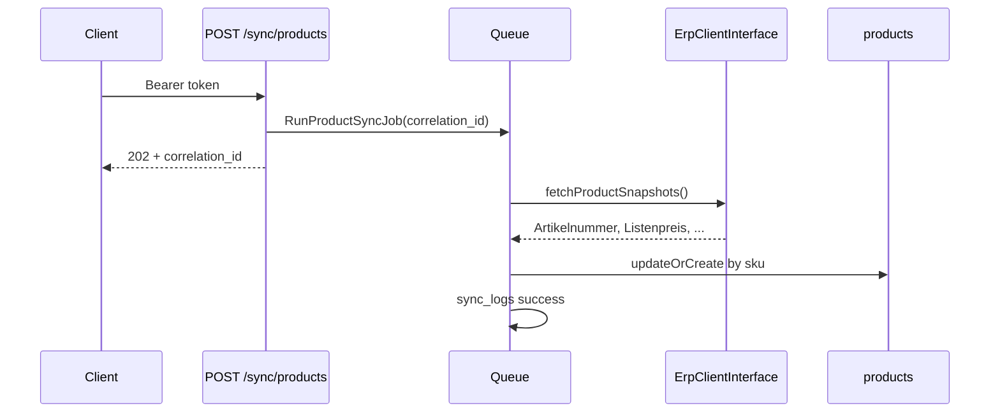
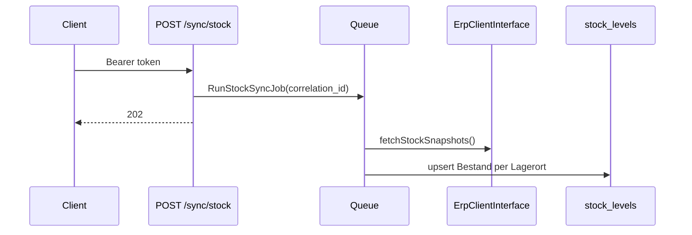
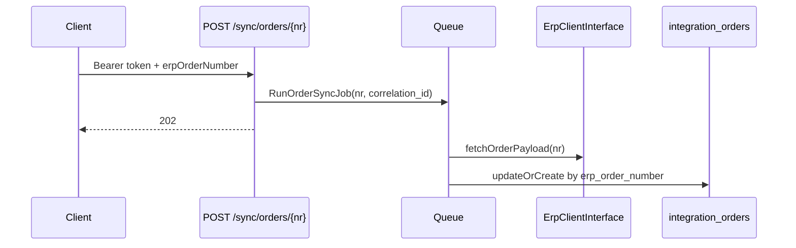
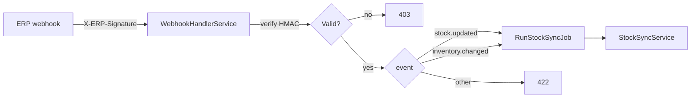

# Sync workflows

This API normalizes B2B ERP data into local tables. All sync work is **asynchronous**: HTTP returns `202 Accepted` with a `correlation_id` for tracing across `sync_logs`, `failed_syncs`, and `api_request_logs`.

## Data domains

| Sync type | ERP source | Local table | Idempotency key |
|-----------|------------|-------------|-----------------|
| Product bulk | `MockErpClient::fetchProductSnapshots()` | `products` | `sku` (`Artikelnummer`) |
| Stock bulk | `MockErpClient::fetchStockSnapshots()` | `stock_levels` | `product_id` + `warehouse_code` (`Lagerort`) |
| Order single | `MockErpClient::fetchOrderPayload($nr)` | `integration_orders` | `erp_order_number` (`Auftragsnummer`) |

German ERP field names are mapped in `app/Integration/Mappers/` — services never parse raw ERP keys directly.

## Product sync



**Trigger:** `POST /api/v1/sync/products` or retry of `failed_syncs` row with `sync_type = product_bulk`.

**Failure:** ERP transport error or mapper validation → `sync_logs` (failed) + `failed_syncs` (pending_retry).

## Stock sync

**Prerequisite:** Products must exist locally. Stock rows reference `Artikelnummer` → `products.sku`.



**Trigger:** `POST /api/v1/sync/stock`, webhook events `stock.updated` / `inventory.changed`, or retry.

**Common failure:** Stock sync before product sync → mapper throws “product not synced” → `failed_syncs` row.

## Order sync



**Trigger:** `POST /api/v1/sync/orders/{erpOrderNumber}` or retry with `sync_type = order_single`.

Demo order `PO-2026-0001` succeeds; `INVALID-ORDER` simulates ERP “not found”.

## Webhook-driven stock sync



Webhooks skip Bearer auth; see [webhook-security.md](webhook-security.md).

## Recommended run order (demo)

1. `POST /api/v1/sync/products`
2. `POST /api/v1/sync/stock` (or send a signed `stock.updated` webhook)
3. `POST /api/v1/sync/orders/PO-2026-0001`

With `QUEUE_CONNECTION=database`, run a worker so jobs execute:

```bash
php artisan queue:work database --tries=3 --backoff=10,60,120
```

## Correlation IDs

Every sync job carries a UUID `correlation_id`:

- Returned in the `202` response body
- Stored on `sync_logs` and `failed_syncs`
- Echoed as `X-Request-Id` on API responses (via `LogApiRequest` middleware)

Use `correlation_id` to tie an HTTP request to downstream audit rows.

## ERP client boundary

`ErpClientInterface` is the only ERP touchpoint. This repo ships `MockErpClient` with deterministic demo payloads — no real tenant URLs or OAuth secrets. Swap the binding in `AppServiceProvider` for a production HTTP adapter.
